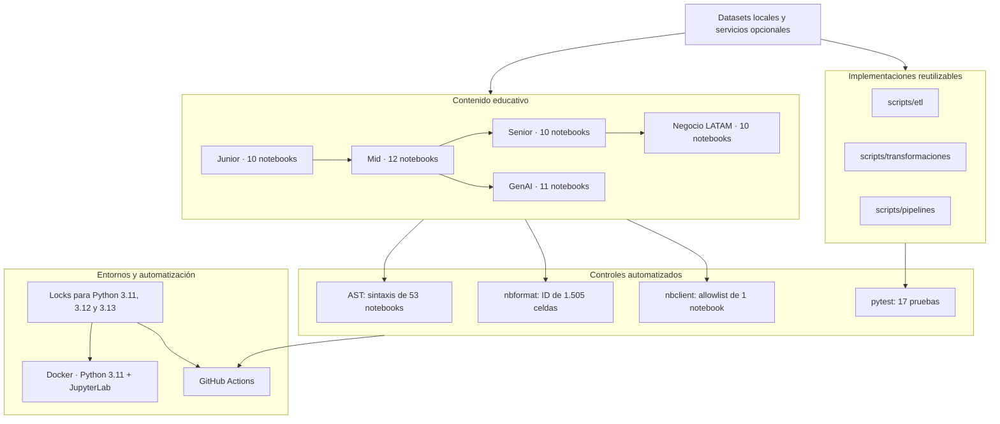
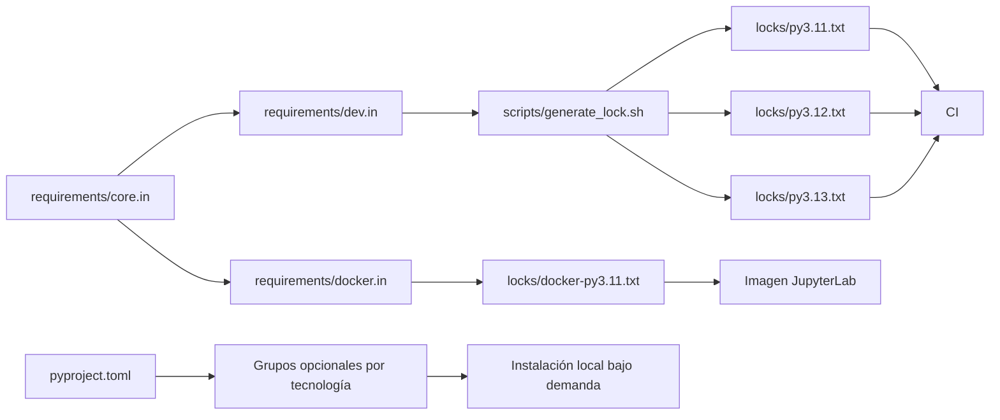
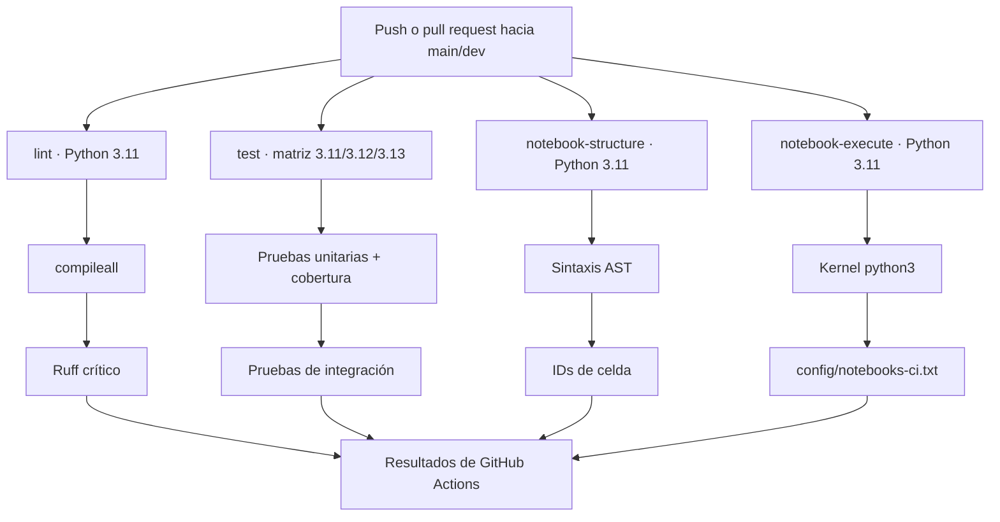

# Arquitectura y controles del repositorio

Este documento describe únicamente componentes presentes en el repositorio.
No representa una plataforma desplegada ni implica que los servicios externos
mencionados en los notebooks estén provisionados.

## Vista general



Las flechas entre niveles representan la ruta recomendada, no una dependencia
técnica estricta. GenAI parte de Mid; Negocio LATAM se beneficia de la visión
arquitectónica de Senior.

## Modelo de dependencias

El repositorio mantiene dos superficies explícitas:

- Los archivos `requirements/*.in` generan locks exactos para CI y Docker.
- Los grupos de `pyproject.toml` permiten instalar tecnologías opcionales por
  tema. Salvo los grupos materializados en `requirements/*.in`, no tienen un
  lock verificado en este repositorio.



### Perfiles disponibles

| Perfil | Fuente | Uso |
| --- | --- | --- |
| Core | `[project.dependencies]` y `requirements/core.in` | Scripts y pipelines básicos |
| Desarrollo | grupo `dev` y `requirements/dev.in` | Tests, lint y validación de notebooks |
| Jupyter | grupo `notebooks` y `requirements/docker.in` | Laboratorios locales y Docker |
| Cloud | `cloud-aws`, `cloud-gcp`, `cloud-azure` | Ejercicios opcionales por proveedor |
| Datos | `databases`, `airflow`, `spark` | Servicios y motores especializados |
| GenAI | `genai` | OpenAI, Google GenAI, RAG y embeddings |

## Integración continua

Los cuatro jobs siguientes son independientes. El workflow no despliega
infraestructura ni publica artefactos.



La protección de ramas y la exigencia de checks son configuraciones de GitHub
pendientes de realizar fuera del repositorio; no se asumen activas.

## Controles de calidad

| Control | Detecta | No demuestra |
| --- | --- | --- |
| `compileall` y Ruff | Sintaxis/errores críticos en scripts y tests | Corrección funcional completa |
| Pytest unitario | Transformaciones y funciones aisladas | Integraciones externas reales |
| Pytest de integración | Flujos ETL locales con IO temporal y mocks | Disponibilidad cloud o de APIs |
| Validador AST | Sintaxis Python de celdas compatibles | Imports instalados o ejecución ordenada |
| Validador de metadata | IDs válidos y presentes en celdas | Calidad pedagógica del contenido |
| Ejecución allowlisted | Ejecución real de un notebook local | Ejecución de los otros 52 notebooks |

## Decisiones y límites conocidos

- Python soportado por el proyecto: `>=3.11,<3.14`; CI cubre 3.11, 3.12 y
  3.13.
- La imagen Docker usa Python 3.11 y el lock de JupyterLab.
- Los notebooks GenAI y varios laboratorios de Mid/Senior pueden requerir
  credenciales, red o servicios que CI no proporciona.
- Las cifras económicas de Negocio LATAM son escenarios didácticos salvo que
  una celda cite una fuente concreta.
- El workflow actual usa tags mayores de acciones oficiales y Dependabot para
  actualizaciones. La fijación a SHA inmutable sería un endurecimiento futuro.

## Validación de diagramas

Los diagramas usan sintaxis Mermaid compatible con Markdown de GitHub. Para
renderizarlos localmente con Mermaid CLI:

```bash
npx --yes @mermaid-js/mermaid-cli@11.16.0 \
  --input docs/arquitectura.md \
  --output arquitectura-rendered.md
```

El archivo de salida es temporal y no debe versionarse. GitHub también permite
revisar el resultado visual directamente en la vista Markdown.
